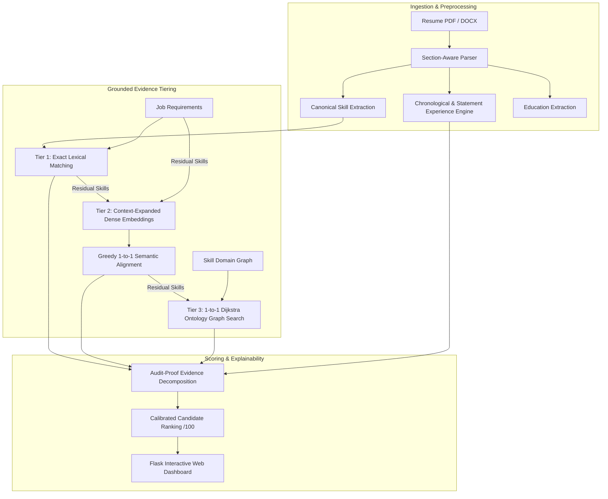

# HireSense Engine

**HireSense** is a grounded, explainable resume-job matching and candidate ranking engine. It bridges **deterministic lexical constraints**, **dense semantic representations (`all-MiniLM-L6-v2`)**, and **domain ontology graph reasoning** to make automated candidate evaluation transparent and faithful.

I built it to practice combining a classic algorithm (Dijkstra on a skill graph), a sentence-embedding model, and plain string matching in one pipeline, and to make the score explainable rather than a single opaque number.

---

## Key Principles & Architecture

HireSense enforces a strict **hierarchical evidence partition** for every required job skill:

```text
Exact Lexical Match  ──(unmatched residual)──>  Dense Semantic Similarity  ──(unmatched residual)──>  Ontology Graph Reasoning  ──>  No Evidence
```



### Core Design Guarantees:
1. **Zero Double-Counting (Strict Partitioning)**: A candidate skill committed to exact or semantic credit cannot be reused as evidence for any subsequent requirement.
2. **1-to-1 Bipartite Evidence Assignment**: Prevents broad single skills (e.g. `ai`) from satisfying multiple specialized requirements (e.g. `python, ml, nlp, pytorch`).
3. **Context-Expanded Semantic Embeddings**: Contextually enriches technical acronyms (`nlp` $\rightarrow$ `natural language processing and computational linguistics`, `llm` $\rightarrow$ `large language models generative ai`) before dense encoding, eliminating out-of-vocabulary representation degradation.
4. **Chronological Experience Verification**: Parses explicit summary statements and chronological date ranges (`2020 – 2024`, `2021 – Present`) to verify seniority constraints.

---

## Evidence Tiers & Scoring Formulation

The final score is composed of **85% Skill Evidence** and **15% Experience Verification**:

$$\text{Final Score} = \min\left(100, S_{\text{skill}} + S_{\text{exp}}\right)$$

### 1. Skill Component ($S_{\text{skill}} \le 85$)
For $N$ required job skills, each requirement $r_i$ receives credit $c_i \in [0.0, 1.0]$ from the first tier that satisfies it:
- **Exact Match**: $c_i = 1.0$ (candidate explicitly possesses the canonicalized skill).
- **Dense Semantic Match**: $c_i = \text{clip}\left(\frac{\text{sim}(r_i, s_j) - \theta}{1.0 - \theta}, 0.0, 1.0\right)$ where threshold $\theta = 0.45$ and $s_j$ is an unconsumed candidate skill.
- **Graph Reasoning Match**: 
  - Shortest distance $= 1$: $c_i = 1.0$
  - Shortest distance $= 2$: $c_i = 0.5$
  - Shortest distance $> 2$ or disconnected: $c_i = 0.0$
- **No Evidence**: $c_i = 0.0$

$$S_{\text{skill}} = 85 \times \frac{1}{N} \sum_{i=1}^N c_i$$

### 2. Experience Component ($S_{\text{exp}} \le 15$)
Given requested minimum experience $E_{\text{req}}$ and candidate experience $E_{\text{cand}}$:

$$S_{\text{exp}} = 15 \times \min\left(1.0, \frac{E_{\text{cand}}}{E_{\text{req}}}\right)$$

*(When no experience requirement is requested, skill subcomponents scale proportionally to 100 so all evidence points remain transparent and directly additive).*

---

## Project Structure

```text
HireSense-Engine/
├── include/                     # C++ Header declarations
│   ├── analyzer.h               # Hybrid scoring engine & evidence coordinator
│   ├── graph.h                  # Adjacency list & Dijkstra path solver
│   └── resume.h                 # Candidate evidence record data structures
├── src/                         # C++ Engine implementation
│   ├── analyzer.cpp             # Bipartite 1-to-1 scoring & subscore normalization
│   ├── graph.cpp                # Dijkstra shortest-path implementation
│   └── main.cpp                 # Fast CLI pipeline & TSV serialization
├── nlp/                         # Natural Language Processing & Ontology
│   ├── parser.py                # Section-aware parser & date-range experience extractor
│   ├── semantic.py              # SentenceTransformer dense embeddings & acronym expansion
│   ├── skill_vocabulary.json    # Canonical skill aliases & dictionary
│   └── skills.txt               # Curated domain ontology graph edges
├── web/                         # Interactive Evaluation Dashboard
│   ├── app.py                   # Flask server & pipeline orchestration
│   ├── static/styles.css        # Clean UI styling
│   └── templates/index.html     # Auditable candidate ranking view
├── scripts/                     # Cross-platform build scripts
│   ├── build.ps1                # PowerShell build script (Windows)
│   └── build.sh                 # Bash build script (Linux / macOS)
├── tests/                       # Verification & Benchmark Suite
│   └── test_pipeline.py         # Automated unit & integration tests
├── examples/                    # Sample inputs & job profiles
│   └── job.txt
├── requirements.txt             # Python dependencies
└── README.md
```

---

## Quickstart & Installation

### 1. Environment Setup
Python 3.10+ and a C++17 compiler (`g++` / `clang++` / `MSVC`) are required.

```bash
# Clone the repository
git clone https://github.com/<your-username>/HireSense-Engine.git
cd HireSense-Engine

# Create virtual environment
python -m venv .venv

# Activate environment (Windows PowerShell)
.\.venv\Scripts\Activate.ps1

# Activate environment (Linux / macOS)
source .venv/bin/activate

# Install dependencies
pip install -r requirements.txt
```

### 2. Build the C++ Engine

**Windows PowerShell:**
```powershell
.\scripts\build.ps1
```

**Linux / macOS:**
```bash
chmod +x scripts/build.sh
./scripts/build.sh
```

### 3. Run Automated Tests
```bash
python tests/test_pipeline.py
```

### 4. Launch the Web Dashboard
```bash
python web/app.py
```
Open `http://127.0.0.1:5000` in your browser.

---

## Evaluation & Rigor

HireSense addresses the core research challenges of **grounded reasoning, hallucination reduction, and explainability** in AI-driven document intelligence:
- **Transparency**: Every score is decomposable into concrete exact keywords, embedding cosine similarities, and ontology path relationships.
- **Robustness**: 1-to-1 bipartite constraints ensure adversarial keyword stuffing (e.g. inserting single buzzwords) cannot exploit downstream evidence categories.
- **Evaluation**: The test suite includes standard ranking metrics (Normalized Discounted Cumulative Gain — **NDCG@K**) for empirical benchmark comparisons.

---
## Known limitations

I would rather list these than hide them:

- **No evaluation.** I have not compared the rankings with human judgment or with baselines such as TF-IDF or BM25, so I cannot claim it ranks better than keyword search.
- **Small, hand-built vocabulary and graph.** 110 skills and 64 edges, created manually. Skills outside the vocabulary are only matched if typed exactly.
- **Greedy matching.** Both the semantic and graph tiers assign skills greedily, so results can depend on the order of the required skills. It is not an optimal assignment.
- **Hand-written acronym descriptions.** The expanded descriptions for ~26 acronyms were written by me, but their scope can be expanded in the future.
- **Keyword extraction, not understanding.** Skills are detected by matching names in resume sections. Coursework titles count as skill evidence, and a skill mentioned in passing counts the same as one used extensively.
- **Synthetic test data.** The sample resumes were generated, not real, and there are only a handful.
- **Not for real hiring.** Automated resume screening can be unfair or wrong. This is a learning prototype.

## Possible next steps

- Build a small labeled set of resumes and measure NDCG against TF-IDF, embeddings-only, and this hybrid.
- Reduce graph credit and make edges directional (specific → general).
- Embed full resume sentences instead of single skill names.
- Replace the hand-written vocabulary with a standard skill taxonomy.

## AI assistance

I developed this project with help from an LLM for code and documentation. I wrote the design, initial code, reviewed and tested the code, and I am responsible for its contents.


## License
MIT License. Built for research and transparent decision-support exploration.
